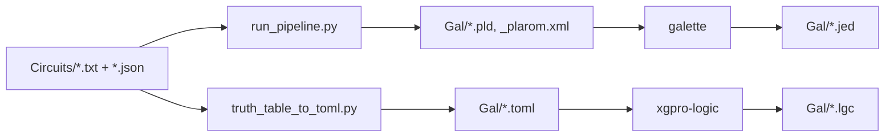

# Projeto processador

Esse é meu projeto de um processador simples

----------

### Como usar (Make)

Todo o fluxo de build é feito via **Make**. No Windows os comandos rodam dentro do WSL; em Linux/macOS rodam nativamente.

**Pré-requisitos**

- Windows: [WSL](https://learn.microsoft.com/en-us/windows/wsl/) instalado e configurado.
- No WSL (ou no sistema, se for Linux/macOS): o Makefile usa `python3` e as ferramentas compiladas em `Progs/`.

**Primeira vez**

Compile as ferramentas (Espresso, Galette, xgpro-logic). O target `build-progs` instala dependências no WSL se necessário (gcc, cargo, go) e compila tudo:

```bash
make build-progs
```

**Gerar artefatos**

Coloque em `Circuits/` arquivos de tabela verdade (`.txt`) e config/pinout (`.json`) com o **mesmo nome base** (ex.: `teste.txt` e `teste.json`). Depois:

```bash
make
```

ou `make all`. As saídas são geradas em `Gal/`: `.pld`, `.jed`, `.toml`, `.lgc` (e `_plarom.xml` para PLA/ROM).

**Limpar**

- `make clean-gal` — remove o conteúdo de `Gal/`
- `make clean-progs` — limpa os builds das ferramentas em `Progs/`

**Targets do Makefile**

| Target | Descrição |
|--------|------------|
| `all` (default) | Gera .pld, .jed, .toml, .lgc em Gal/ para cada par .txt+.json em Circuits/ |
| `build-progs` | Instala deps no WSL e compila espresso, galasm, xgpro-logic |
| `install-deps` | Instala gcc, cargo, go no WSL (chamado por build-progs) |
| `clean-gal` | Remove conteúdo de Gal/ |
| `clean-progs` | Limpa builds das ferramentas em Progs/ |

**Pipeline**

O Make usa os scripts Python (`run_pipeline.py` com `eq_to_pld`, `truth_table_to_toml.py`) e as ferramentas em `Progs/` (espresso, galette, xgpro-logic) para transformar cada par `Circuits/<nome>.txt` + `Circuits/<nome>.json` nos arquivos em `Gal/`.



----------

### Programar hardware (minipro no WSL)

Para gravar o `.jed` no dispositivo via minipro no Windows, use WSL e usbipd para expor o USB:

https://learn.microsoft.com/en-us/windows/wsl/connect-usb

https://github.com/dorssel/usbipd-win/releases

No Windows rode `usbipd list` para pegar o ID do dispositivo USB
ainda no Windows rode `usbipd bind --busid <busid>` para capturar o dispositivo pelo usbipd
depois `usbipd attach --wsl --busid <busid>` para disponibilizar para o WSL

----------

### Scripts folder

O fluxo recomendado é via **Make**; os scripts são usados internamente pelo Makefile. Todos os scripts podem ser usados também como **standalone** na linha de comando. No Windows, use `wsl` ou rode dentro do WSL.

#### run_pipeline.py

Orquestra o pipeline completo: tabela verdade do Logisim → PLA → Espresso → equações por bit de saída → geração de `.pld` e opcionalmente `_plarom.xml`. Usa o módulo `eq_to_pld` para aplicar a config em JSON.

```bash
# Entrada por arquivo; PLD e PLA-ROM para arquivos (config = <nome>.json no mesmo dir que -i)
python3 scripts/run_pipeline.py -i Exemplo/teste.txt --pld-out Gal/teste.pld --pla-rom-out Gal/teste_plarom.xml

# Entrada por stdin; PLD na stdout
cat Exemplo/teste.txt | python3 scripts/run_pipeline.py --pld-config Exemplo/teste.json --pld-out

# Opções úteis: --espresso PATH, -n (negate), --pld-device, --pld-name, --pld-pin N=LABEL, --pld-desc LINE
python3 scripts/run_pipeline.py --help
```

#### truth_table_to_toml.py

Converte tabela verdade (.txt) + pinout (.json) em TOML para o xgpro-logic (vetores de teste).

```bash
python3 scripts/truth_table_to_toml.py Exemplo/teste.txt Exemplo/teste.json -o Gal/teste.toml
# Sem -o: grava <nome_da_tabela>.toml no diretório atual
python3 scripts/truth_table_to_toml.py --help
```

#### logisim_to_pla.py

Converte tabela verdade do Logisim para o formato PLA do Espresso (entrada para o binário `espresso`). Saída na stdout para encadear no pipeline.

```bash
# Pipeline: tabela → PLA → espresso → ...
python3 scripts/logisim_to_pla.py -i Exemplo/teste.txt | ./Progs/espresso-logic/bin/espresso

# Gravar PLA em arquivo (se não for encadear)
python3 scripts/logisim_to_pla.py -i Exemplo/teste.txt -o pla.txt
python3 scripts/logisim_to_pla.py --help
```

#### truth_table_to_pla.py

Converte tabela verdade do Logisim para **um único** PLA com todos os bits de entrada e de saída por termo (interpretável pelo componente PLA). Por defeito a saída vai para stdout; use `--out-pla` para gravar num ficheiro. Minimiza com Espresso por defeito.

```bash
# Saída para stdout (encadear no pipeline ou redirecionar)
python3 scripts/truth_table_to_pla.py Circuits/Docs/InstructionDecoder.txt

# Gravar num ficheiro
python3 scripts/truth_table_to_pla.py Circuits/Docs/InstructionDecoder.txt --out-pla Circuits/Docs/InstructionDecoder.pla

# Sem minimização (PLA bruto)
python3 scripts/truth_table_to_pla.py Circuits/Docs/InstructionDecoder.txt --no-minimize --out-pla Circuits/Docs/decoder.pla

# Don't-care como 'x' em vez de '-'
python3 scripts/truth_table_to_pla.py Circuits/Docs/InstructionDecoder.txt --use-x --out-pla out.pla
python3 scripts/truth_table_to_pla.py --help
```

#### split.py

Separa a saída do Espresso por índice do bit de saída. Lê PLA na stdin ou de arquivo; imprime apenas as linhas do bit pedido (por padrão troca `-` por `x` para PLA no Logisim).

```bash
# Pipeline: tabela → PLA → espresso → split (bit 0-based)
python3 scripts/logisim_to_pla.py -i Exemplo/teste.txt | ./Progs/espresso-logic/bin/espresso | python3 scripts/split.py 0

# Bit 2 (terceiro bit de saída)
python3 scripts/logisim_to_pla.py -i Exemplo/teste.txt | ./Progs/espresso-logic/bin/espresso | python3 scripts/split.py 2

# Não trocar '-' por 'x'
python3 scripts/logisim_to_pla.py -i Exemplo/teste.txt | ./Progs/espresso-logic/bin/espresso | python3 scripts/split.py --no-dash-to-x 0
python3 scripts/split.py --help
```

#### gen_eq.py

Converte linhas de mintermos (formato Espresso, ex.: `01-1 1`) em uma equação soma-de-produtos. É preciso informar o nome de cada bit de entrada com `-m` (ordem = bit 0, 1, 2, …).

```bash
# Pipeline completo: tabela → PLA → espresso → split (bit 2) → equação
python3 scripts/logisim_to_pla.py -i Exemplo/teste.txt | ./Progs/espresso-logic/bin/espresso | python3 scripts/split.py 2 | python3 scripts/gen_eq.py -m A2 -m A1 -m A0 -m B1 -m B0

# Outro bit (0) com negate
python3 scripts/logisim_to_pla.py -i Exemplo/teste.txt | ./Progs/espresso-logic/bin/espresso | python3 scripts/split.py 0 | python3 scripts/gen_eq.py -m I0 -m I1 -n
python3 scripts/gen_eq.py --help
```

#### create_table.py

Gera uma tabela verdade de exemplo (8 entradas, 12 saídas) com lógica fixa (BCD para binário, etc.). Sem argumentos; imprime na stdout no formato `input_bits | output_bits`. Útil para testar o pipeline ou gerar dados de entrada.

```bash
python3 scripts/create_table.py > Exemplo/exemplo.txt
```

**Módulos sem CLI**

- **split_sop.py** — Funções para dividir uma equação soma-de-produtos em vários blocos (limite de termos do GAL22V10). Usado como biblioteca pelo `run_pipeline` / `eq_to_pld`.
- **pla_to_plarom.py** — Converte linhas PLA (Espresso) para o formato Contents do componente PlaRom do Logisim-evolution. Usado como biblioteca pelo `run_pipeline`.

Para o uso normal do repositório, basta rodar `make`; o Makefile define entradas e parâmetros.

----------

### Prog folder

As ferramentas em `Progs/` são compiladas com **`make build-progs`** e usadas automaticamente pelo Makefile. Para o fluxo normal não é necessário invocá-las manualmente. Abaixo está a documentação de uso manual para referência.

#### xgpro-logic

Programa usado para converter .toml, .json ou .xml em um formato que possa ser importado pelo xgpro para criar vetores de teste, consulte exemplo de como fazer

#### Galasm

Programa usado para "Compilar" programas pld (gal) para gerar .jed

o resultado .jed é usado diretamente no Xgpro (programador universal)

```pld
GAL22V10 ; modelo do Chip
StateMachine ; Nome do projeto

;Definição dos pinos
;1    2     3     4     5     6     7     8     9     10    11   12
Clock I0    I1    I2    I3    I4    I5    I6    I7    I8    I9   GND
I11   O0    O1    O2    O3    O4    NC    O5    O6    O7    O8   VCC
;13   14    15    16    17    18    19    20    21    22    23   24

;Exemplo basico de circuito combinacional
O1 = I2 + I3


;Clock sempre deve ser o Pino 1
;AR 'Async Reset' para todos os FlipFlop D
AR = I0
;.R Usa esse Pino como um registrador
O0.R = I1


DESCRIPTION
Descrição do projeto text livre
```

Forma de usar
`
galette prog.pld
`

#### Espresso-logic


Usado para simplificar tabelas verdade

Vale notar que cada linha é um conjunto de produtos com o resultado final
sendo a soma de todas as linhas

##### Exemplo:
###### input
.i 4
.o 3
0000  000
0001  001
0010  010
0011  011
0100  001
0101  010
0110  011
0111  100
1000  010
1001  011
1010  100
1011  101
1100  011
1101  100
1110  101
1111  110

###### output

.i 4
.o 3
.p 11
0101 010
1111 010
1-00 010
0-10 010
100- 010
001- 010
-111 100
11-1 100
-1-0 001
-0-1 001
1-1- 100
.e
