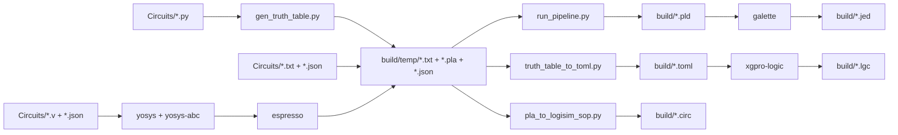

# Projeto processador

Esse é meu projeto de um processador simples

----------

### Como usar (Make)

Todo o fluxo de build é feito via **Make**. No Windows os comandos rodam dentro do WSL; em Linux/macOS rodam nativamente.

**Pré-requisitos**

- Windows: [WSL](https://learn.microsoft.com/en-us/windows/wsl/) instalado e configurado.
- No WSL (ou no sistema, se for Linux/macOS): o Makefile usa `python3`, `yosys`, `yosys-abc` e as ferramentas compiladas em `Progs/`.

**Primeira vez**

Compile as ferramentas (Espresso, Galette, xgpro-logic). O target `build-progs` instala dependências no WSL se necessário (gcc, cargo, go, yosys) e compila tudo:

```bash
make build-progs
```

**Gerar artefatos**

Coloque em `Circuits/` arquivos de tabela verdade (`.txt`) e config/pinout (`.json`) com o **mesmo nome base** (ex.: `teste.txt` e `teste.json`). Scripts Python em `Circuits/` (`.py` com mesmo-nome `.json`) geram tabelas em `build/temp/` e o `.json` é copiado para lá. Arquivos Verilog (`.v` com mesmo-nome `.json`) são convertidos para PLA via `yosys`/`yosys-abc` e minimizados com Espresso. Depois:

```bash
make
```

ou `make all`. As saídas são geradas na pasta **configurável** `build/` (default; defina `BUILD_DIR` no Make para outro diretório): `.pld`, `.jed`, `.toml`, `.lgc`, `.circ`. Tabelas e PLAs intermediários gerados ficam em `build/temp/`.

**Limpar**

- `make clean-build` — remove o conteúdo de `build/` (pasta de saída)
- `make clean-gal` — alias para `clean-build` (compatibilidade)
- `make clean-progs` — limpa os builds das ferramentas em `Progs/`

**Targets do Makefile**

| Target | Descrição |
|--------|------------|
| `all` (default) | step1: gera `.txt` em `build/temp` a partir de `Circuits/*.py` e `.pla` a partir de `Circuits/*.v` (via yosys+espresso); step2: gera `.pld`, `.jed`, `.toml`, `.lgc`, `.circ` em `build/` para cada par `.txt+.json` ou `.pla+.json` |
| `build-progs` | Chama `install-deps` e compila espresso, galasm, xgpro-logic |
| `install-deps` | Instala gcc, cargo, go, yosys no WSL (chamado por build-progs) |
| `clean-build` | Remove conteúdo de build/ |
| `clean-gal` | Alias para clean-build |
| `clean-progs` | Limpa builds das ferramentas em Progs/ |

**Pipeline**

O Make usa os scripts Python (`run_pipeline.py`, `truth_table_to_toml.py`, `pla_to_logisim_sop.py`) e as ferramentas em `Progs/` (espresso, galette, xgpro-logic) para transformar cada par `.txt`/`.v` + `.json` (em `Circuits/` ou em `build/temp/`) nos arquivos em `build/`.



----------

### Programar hardware (minipro no WSL)

Para gravar o `.jed` no dispositivo via minipro no Windows, use WSL e usbipd para expor o USB:

https://learn.microsoft.com/en-us/windows/wsl/connect-usb

https://github.com/dorssel/usbipd-win/releases

No Windows rode `usbipd list` para pegar o ID do dispositivo USB
ainda no Windows rode `usbipd bind --busid <busid>` para capturar o dispositivo pelo usbipd
depois `usbipd attach --wsl --busid <busid>` para disponibilizar para o WSL

----------

### Scripts folder

O fluxo recomendado é via **Make**; os scripts são usados internamente pelo Makefile. Todos os scripts podem ser usados também como **standalone** na linha de comando. No Windows, use `wsl` ou rode dentro do WSL.

#### run_pipeline.py

Orquestra o pipeline completo: tabela verdade do Logisim (ou PLA pré-minimizado) → Espresso → equações por bit de saída → geração de `.pld`. Usa o módulo `eq_to_pld` para aplicar a config em JSON.

```bash
# Entrada por arquivo .txt; PLD para arquivo (config = <nome>.json no mesmo dir que -i)
python3 scripts/run_pipeline.py -i Exemplo/teste.txt --pld-out build/teste.pld

# Entrada por stdin; PLD na stdout
cat Exemplo/teste.txt | python3 scripts/run_pipeline.py --pld-config Exemplo/teste.json --pld-out

# Entrada como PLA já minimizado (pula parsing e minimização)
python3 scripts/run_pipeline.py --pla-input -i build/temp/teste.pla --pld-config Exemplo/teste.json --pld-out build/teste.pld

# Opções úteis: --espresso PATH, -n (negate), --pld-device, --pld-name, --pld-pin N=LABEL, --pld-desc LINE
python3 scripts/run_pipeline.py --help
```

#### truth_table_to_toml.py

Converte tabela verdade (.txt) + pinout (.json) em TOML para o xgpro-logic (vetores de teste).

```bash
python3 scripts/truth_table_to_toml.py Exemplo/teste.txt Exemplo/teste.json -o Gal/teste.toml
# Sem -o: grava <nome_da_tabela>.toml no diretório atual
python3 scripts/truth_table_to_toml.py --help
```

#### truth_table_to_pla.py

Converte tabela verdade do Logisim para PLA compatível com Espresso. O Logisim exporta um formato similar ao PLA standard, mas usa `x` em vez de `-` para representar don't-cares; este script faz essa conversão. A saída vai para stdout (apenas linhas de dados, sem cabeçalho); use `--out-pla` para gravar em ficheiro. Minimiza com Espresso por defeito.

```bash
# Saída para stdout (encadear no pipeline)
python3 scripts/truth_table_to_pla.py Circuits/Docs/InstructionDecoder.txt

# Gravar num ficheiro
python3 scripts/truth_table_to_pla.py Circuits/Docs/InstructionDecoder.txt --out-pla build/decoder.pla

# Sem minimização (PLA bruto)
python3 scripts/truth_table_to_pla.py Circuits/Docs/InstructionDecoder.txt --no-minimize --out-pla build/decoder.pla

# Manter cabeçalhos PLA (.i, .o, .ilb, .ob, .p, .e) na saída
python3 scripts/truth_table_to_pla.py Circuits/Docs/InstructionDecoder.txt --keep-header --out-pla build/decoder.pla

# Don't-care como 'x' em vez de '-'
python3 scripts/truth_table_to_pla.py Circuits/Docs/InstructionDecoder.txt --use-x --out-pla out.pla
python3 scripts/truth_table_to_pla.py --help
```

#### discover_targets.py

> **Uso interno** — chamado pelo Makefile para descoberta dinâmica de arquivos-fonte. Não é necessário invocá-lo manualmente no fluxo normal.

Descobre arquivos-fonte em `Circuits/` e `build/temp/` que satisfazem critérios específicos (par `.txt`+`.json`, `.py`, `.v`, `.pla`). Imprime os caminhos encontrados na stdout.

```bash
# .txt em Circuits/ que têm .json correspondente
python3 scripts/discover_targets.py --circuits-txt

# .txt gerados em build/temp/ a partir de .py (excluindo os que já estão em Circuits/)
python3 scripts/discover_targets.py --temp-txt build

# .py em Circuits/ (qualquer)
python3 scripts/discover_targets.py --py

# .py em Circuits/ que têm .json correspondente
python3 scripts/discover_targets.py --py-with-json

# .v em Circuits/ que têm .json correspondente
python3 scripts/discover_targets.py --verilog-with-json

# .pla minimizados em build/temp/ com .json correspondente (excluindo _full.pla)
python3 scripts/discover_targets.py --temp-pla build
```

#### pla_to_logisim_sop.py

Converte um arquivo PLA (formato Espresso, com ou sem cabeçalhos) em um circuito Logisim-evolution `.circ` implementado como soma-de-produtos (SOP) usando portas AND, OR e NOT.

```bash
# Saída para arquivo .circ
python3 scripts/pla_to_logisim_sop.py build/temp/teste.pla --out-circ build/teste.circ

# Stdin → stdout
cat build/temp/teste.pla | python3 scripts/pla_to_logisim_sop.py - --circuit-name MeuCircuito --out-circ build/teste.circ

# Pipeline: tabela → PLA (com cabeçalho) → circuito Logisim
python3 scripts/truth_table_to_pla.py Circuits/teste.txt --keep-header \
  | python3 scripts/pla_to_logisim_sop.py - --circuit-name teste --out-circ build/teste.circ

python3 scripts/pla_to_logisim_sop.py --help
```

#### gen_truth_table.py

Gera tabela verdade no formato Logisim de forma procedural: recebe código Python que define uma classe com `INPUTS`, `OUTPUTS` e o método `compute(**kwargs) -> dict`. Itera sobre todas as combinações de entrada (suporta mais de 32 bits com `int` de precisão arbitrária), escreve em streaming (e em paralelo com `-j N`) e produz um `.txt` importável no Logisim.

```bash
# Arquivo com a classe
python3 scripts/gen_truth_table.py -i spec.py -o Circuits/Docs/table.txt

# Entrada por stdin; paralelo com 4 workers
cat spec.py | python3 scripts/gen_truth_table.py -i - -o table.txt -j 4

# Especificar nome da classe
python3 scripts/gen_truth_table.py -i spec.py -c Decoder -o table.txt
python3 scripts/gen_truth_table.py --help
```

**Módulos de biblioteca** (`scripts/lib/`)

- **logisim_to_pla.py** — Converte tabela verdade Logisim para formato PLA do Espresso. Possui CLI própria (`-i INPUT`, `-o OUTPUT`); também importado pelos outros scripts.
- **eq_to_pld.py** — Gera arquivos `.pld` compatíveis com o GALASM a partir de blocos de equações e config JSON. Possui CLI própria (`--config`, `--device`, `--name`, `-p N=LABEL`); usado pelo `run_pipeline.py`.
- **split_sop.py** — Divide equações soma-de-produtos em múltiplos blocos quando excedem o limite de termos do GAL22V10. Usado como biblioteca pelo `run_pipeline.py` / `eq_to_pld.py`.
- **espresso.py** — Localiza e invoca o binário Espresso; suporta fallback automático para WSL no Windows. Usado como biblioteca pelos scripts que precisam de minimização.

Para o uso normal do repositório, basta rodar `make`; o Makefile define entradas e parâmetros.

----------

### Prog folder

As ferramentas em `Progs/` são compiladas com **`make build-progs`** e usadas automaticamente pelo Makefile. Para o fluxo normal não é necessário invocá-las manualmente. Abaixo está a documentação de uso manual para referência.

#### xgpro-logic

Programa usado para converter .toml, .json ou .xml em um formato que possa ser importado pelo xgpro para criar vetores de teste, consulte exemplo de como fazer

#### Galasm

Programa usado para "Compilar" programas pld (gal) para gerar .jed

o resultado .jed é usado diretamente no Xgpro (programador universal)

```pld
GAL22V10 ; modelo do Chip
StateMachine ; Nome do projeto

;Definição dos pinos
;1    2     3     4     5     6     7     8     9     10    11   12
Clock I0    I1    I2    I3    I4    I5    I6    I7    I8    I9   GND
I11   O0    O1    O2    O3    O4    NC    O5    O6    O7    O8   VCC
;13   14    15    16    17    18    19    20    21    22    23   24

;Exemplo basico de circuito combinacional
O1 = I2 + I3


;Clock sempre deve ser o Pino 1
;AR 'Async Reset' para todos os FlipFlop D
AR = I0
;.R Usa esse Pino como um registrador
O0.R = I1


DESCRIPTION
Descrição do projeto text livre
```

Forma de usar
`
galette prog.pld
`

#### Espresso-logic


Usado para simplificar tabelas verdade

Vale notar que cada linha é um conjunto de produtos com o resultado final
sendo a soma de todas as linhas

##### Exemplo:
###### input
.i 4
.o 3
0000  000
0001  001
0010  010
0011  011
0100  001
0101  010
0110  011
0111  100
1000  010
1001  011
1010  100
1011  101
1100  011
1101  100
1110  101
1111  110

###### output

.i 4
.o 3
.p 11
0101 010
1111 010
1-00 010
0-10 010
100- 010
001- 010
-111 100
11-1 100
-1-0 001
-0-1 001
1-1- 100
.e
